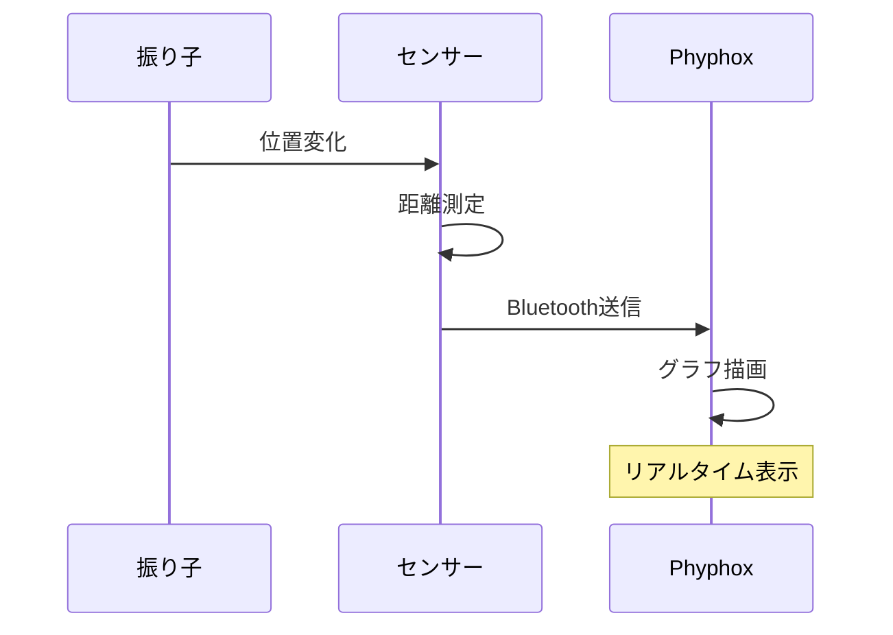

# 🚀 M5StickC Plus2 距離測定ロガー

**M5StickC Plus2とToF HATで物理実験をもっと面白く！**

<div class="grid cards" markdown>

-   :material-school: **学習者向け**

    ---

    基本的な使い方と実験手順を分かりやすく説明

    [:octicons-arrow-right-24: 使い方ガイド](student.md)

-   :material-human-male-board: **教師向け**

    ---

    指導のポイントと技術的背景を詳しく解説

    [:octicons-arrow-right-24: 指導者ガイド](teacher.md)

-   :material-cog: **開発者向け**

    ---

    技術仕様とライブラリの詳細情報

    [:octicons-arrow-right-24: 技術仕様書](docs.md)

-   :material-help-circle: **GitHub サポート**

    ---

    バグ報告や機能提案はGitHubへ

    [:octicons-arrow-right-24: GitHub Issues](https://github.com/phys-ken/M5StickCPlus2_VL53L0X_Phyphox_Logger/issues)

</div>

## ✨ 特徴

!!! tip "このシステムでできること"
    
    === "🔍 距離測定"
        - **測定範囲**: 30mm～2000mm（0.03m～2m）
        - **高精度**: ±3%の測定精度
        - **リアルタイム**: 連続測定とライブ表示
    
    === "📱 スマホ連携"
        - **Phyphoxアプリ**: リアルタイムグラフ表示
        - **Bluetooth接続**: ワイヤレスでデータ転送
        - **CSV出力**: データの保存と分析が可能
    
    === "🏫 教育活用"
        - **複数班対応**: 班ごとのセンサー管理
        - **実験支援**: 物理・数学・情報の学習
        - **簡単セットアップ**: 組み立て5分で実験開始

## 🎯 用途例

=== "物理実験"

    **運動の測定**
    ```mermaid
    graph LR
        A[振り子] --> B[距離センサー]
        B --> C[位置データ]
        C --> D[速度計算]
        D --> E[周期測定]
    ```
    
    - 振り子の周期測定
    - 落下運動の解析
    - 等速直線運動の検証

=== "数学応用"

    **関数とグラフ**
    
    - 時間と距離の関係
    - 微分・積分の視覚化
    - 統計データの処理

=== "情報教育"

    **IoT・データサイエンス**
    
    - センサーデータの取得
    - Bluetooth通信の仕組み
    - リアルタイムデータ処理

## 🛠️ 必要な機材

| 項目 | 説明 | 数量 |
|------|------|------|
| {: style="height:50px"} **M5StickC Plus2** | メインコントローラー | 1台 |
| {: style="height:50px"} **ToF HAT** | 距離センサーモジュール | 1個 |
| 📱 **スマートフォン** | Phyphoxアプリ用 | 1台 |

!!! warning "重要な注意点"
    **ToF HAT**（本体上部装着タイプ）を使用してください。  
    ToF UNIT（ケーブル接続タイプ）とは異なります。

## 🚀 クイックスタート

!!! success "5分で実験開始！"

    1. **ハードウェア組み立て** ⚡
       ```
       M5StickC Plus2 + ToF HAT → 本体上部に装着
       ```

    2. **ソフトウェア準備** 📱
       - スマホにPhyphoxアプリをインストール
       - Arduino IDEでプログラム書き込み

    3. **実験開始** 🎉
       - 電源ON → センサー名を確認
       - Phyphoxで接続 → リアルタイム測定開始！

## 📊 実験例：振り子の測定



## 🎓 学習効果

<div class="annotate" markdown>

このシステムを使うことで、以下の学習効果が期待できます：

- **物理**: 距離・速度・時間の関係性の理解 (1)
- **数学**: グラフ読み取りと統計処理の実践 (2)  
- **情報**: IoTとデータサイエンスの体験 (3)
- **実験**: 科学的思考とデータ分析スキル (4)

</div>

1. :material-physics: 運動の基本法則を実測データで理解
2. :material-chart-line: 数式とグラフの関係を視覚的に学習
3. :material-wifi: 最新のIoT技術を実際に体験
4. :material-flask: 仮説・実験・検証のサイクルを実践

---

## 🤝 コミュニティ

!!! info "サポートとフィードバック"
    
    - 🐛 **バグ報告**: [GitHub Issues](https://github.com/phys-ken/M5StickCPlus2_VL53L0X_Phyphox_Logger/issues)
    - 💡 **機能提案**: [GitHub Discussions](https://github.com/phys-ken/M5StickCPlus2_VL53L0X_Phyphox_Logger/discussions)
    - 📧 **お問い合わせ**: プロジェクトページをご確認ください

**このプロジェクトがお役に立ちましたら、⭐をつけていただけると嬉しいです！**